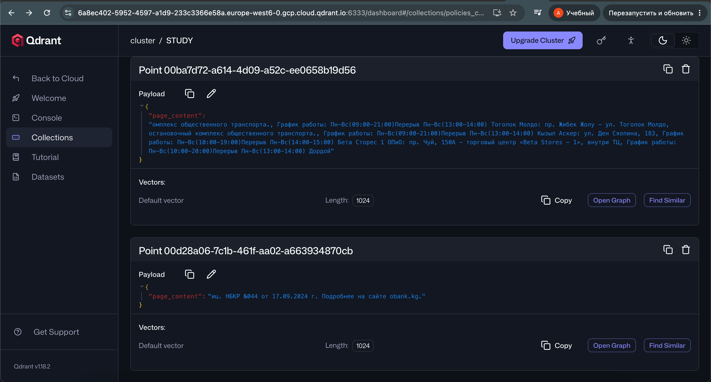
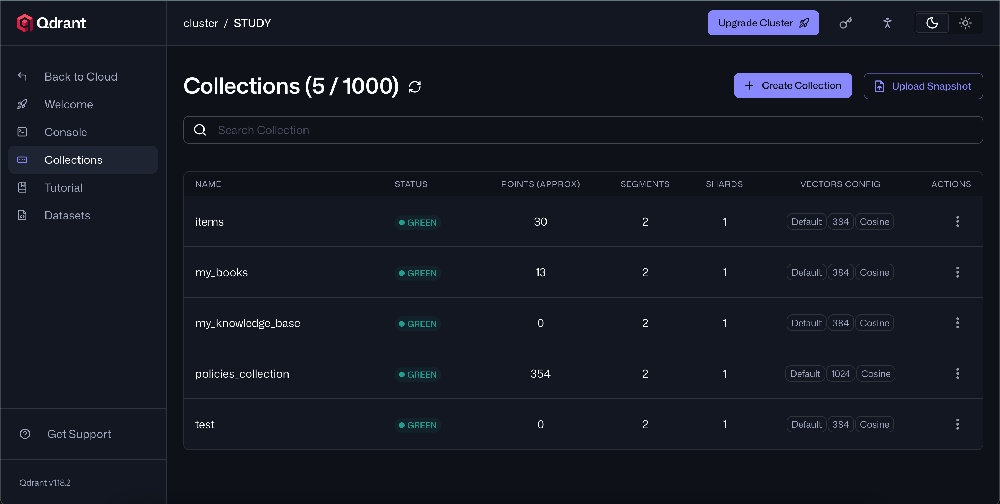
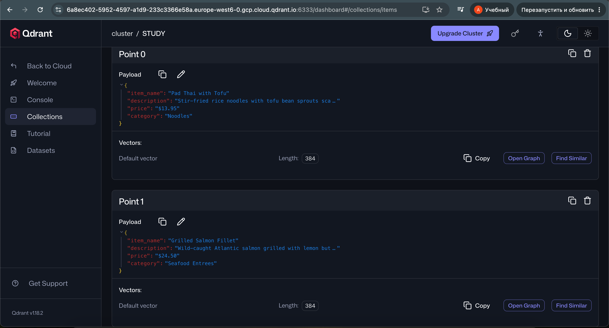
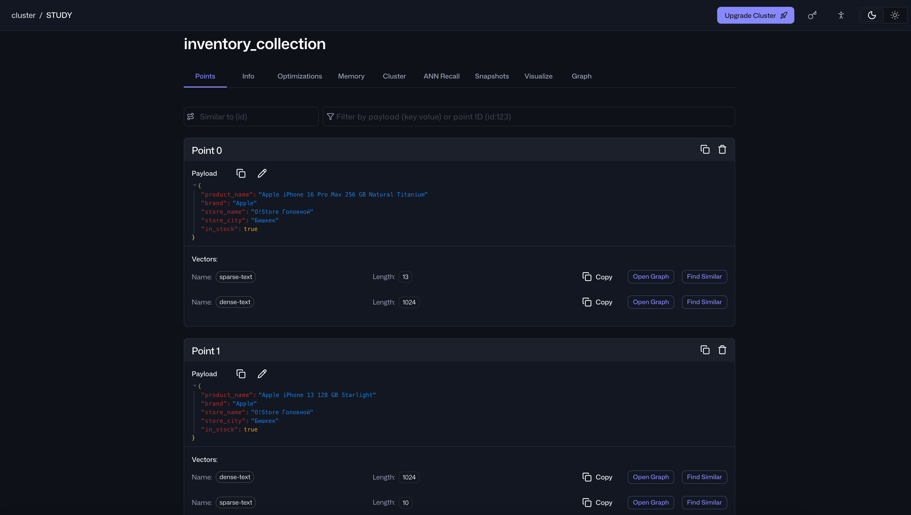
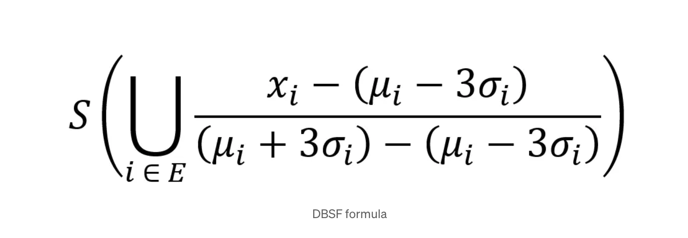

- Первая неделя: Выполнены практические задания по дням 1-4, где я практиковался использовать модель с Prompt'ом и инструментами-функциями для адаптации модели и упрощения её действий (actions)
- Вторая неделя: Изучение Qdrant платформы и освоение функций PointStruct, VectorParams, SentenceTransformers, Distance etc. для практики в Cluster'ах
